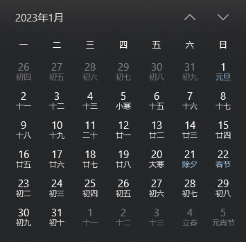

# dayjs-plugin-cnweek

A plugin of dayjs, to get or set the chinese week.

一款 `dayjs` 的插件，用于设置或者获取中国式第几周。

## 什么是“中国式第几周”



在上图中，“中国式第几周”是这样表现的：

1. 2023 年第 1 周为：2023-01-01 ~ 2023-01-01（也就是该周只有 1 天）
2. 2023 年第 2 周为：2023-01-02 ~ 2023-01-08
3. 2023 年第 3 周为：2023-01-09 ~ 2023-01-15
4. ...以此类推

结论：

1. 以 **周一** 为一周的第一天，**周日** 为一周的最后一天
2. **第一周** 可能是不完整的周（不满 7 天），即从当年的 1 月 1 日为开始，当周的周日为结束
3. **中间周** 都是常规周
4. **最后一周** 也可能是不完整的周（不满 7 天），与 “第一周” 同理

如果你有这样的需求，可以使用本插件解决问题。

## 使用方法

```js
import dayjs from 'dayjs'
import cnWeek from '@relaxcoder/dayjs-plugin-cnweek'

// extend
dayjs.extend(cnWeek)

// get week
dayjs('2023-01-01').cnWeek()

// set week
dayjs().cnWeek(1)
```

## API

```ts
/**
 * 获取周数
 * @param {number} week 待设置的周，不传时表示获取第几周
 * @return {object} 返回一个信息对象，结构如下：
 * {
 *     week: number; // 第几周
 *     start: Dayjs; // 本周的起始日
 *     end: Dayjs;   // 本周的结束日
 * }
 */
function cnWeek(): object {}

/**
 * 设置周数
 * @param {number} week 待设置的周
 * @return {Dayjs} 返回一个位于指定周的某天，是一个 Dayjs 对象，具体情况如下：
 * 1. 如果是设置到本年的周，那么“第一周”和“最后一周”不能保证星期对齐（因为这两个周都有可能不满 7 天），其余周会保证星期对齐
 * 2. 如果设置到往年或未来年，那么都不能保证星期对齐，只保证返回的 Dayjs 处于指定周内
 * 3. 星期对齐指的是：一个 Dayjs 设置 cnWeek 后返回的 Dayjs 两者周几保持一致
 */
function cnWeek(week): Dayjs {}
```
